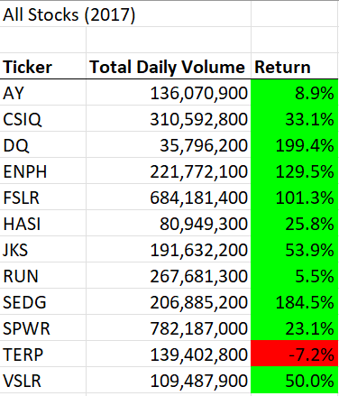
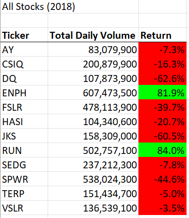

# Stock Analysis

## Overview of Project
* This project analyzes 2017 and 2018 stock data for environmentally friendly corporations. Thus, if an investor wants to put money towards corporations that promise a positive environmental impact, they will know which of those are more sound investments. A stocks' total daily volume is important to look at because the amount of times that it is traded indicates how active it is. The return then shows what percentage of money is gained or lost for an investor who keeps their stock in the corporation for the duration of the year.
## Results
* Most environmental stocks made money in 2017, but lost money in 2018. While TERP was the only stock that lost money in 2017, it performed better in 2018, though still losing money. The only two stocks that continued to make money in 2018 also were the two most active in 2018. These were ENPH and RUN with over 80% return each. This is not a suprprise for ENPH, as its 129.5% return was the third highest in 2017. However, RUN only had a 5.5% return in 2017.

## Summary
