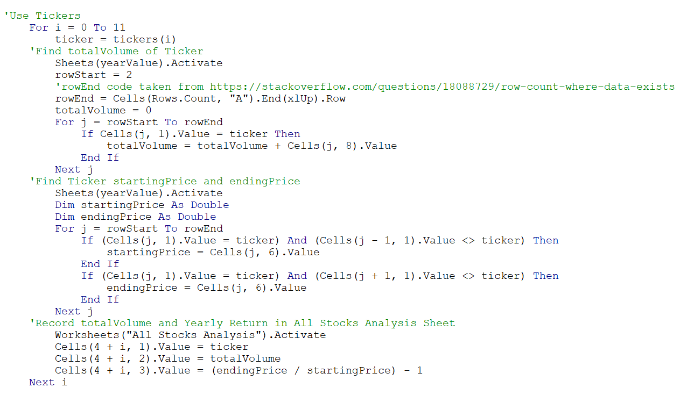
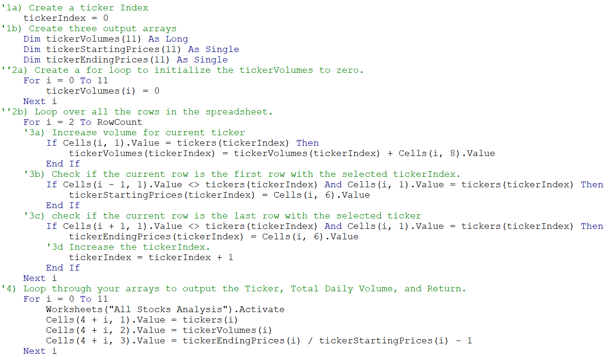
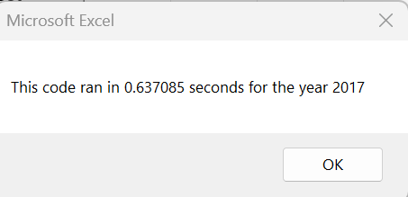
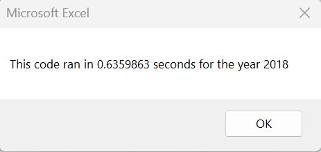
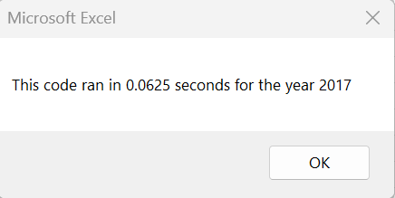
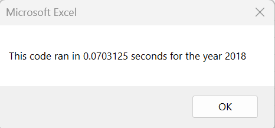

# Stock Analysis

## Overview of Project
* This project analyzes 2017 and 2018 stock data for environmentally friendly corporations. Thus, if an investor wants to put money towards corporations that promise a positive environmental impact, they will know which of those are more sound investments. A stocks' total daily volume is important to look at because the amount of times that it is traded indicates how active it is. The return then shows what percentage of money is gained or lost for an investor who keeps their stock in the corporation for the duration of the year.

## Results

### Stock Analysis
* Most environmental stocks made money in 2017, but lost money in 2018. While TERP was the only stock that lost money in 2017, it performed better in 2018, though still losing money. The only two stocks that continued to make money in 2018 also were the two most active in 2018. These were ENPH and RUN with over 80% return each. This is not a suprprise for ENPH, as its 129.5% return was the third highest in 2017. However, RUN only had a 5.5% return in 2017. If I were to pick a single environmental stock to invest in, I would choose RUN. It's jump in return between 2017 and 2018 despite an overall downwards trend during this year indicates that there has been a positive recent development that warrants further research.

### Refactoring
* While I originally had working code, it was slightly inefficient. The total volume, starting, and ending values for each ticker became arrays during refactoring. This allowed for the code to loop through the data once then output the results after collecting each individual value. Compare the for loop in the original code to the use of arrays in the refactored code.

#### Original Code

#### Refactored Code

### Run Times
* Before refactoring, the code took about 0.6 seconds to find the total daily volume and return for each ticker. After refactoring, it took about a tenth of this time. This proves that the refactored code is far more efficient. The first two images show the run times for the original code, while the second two images show the run times for the refactored code.

## Summary
* Refactoring code is important, as it allows for your code to run much more efficiently. This is important when considering the fact that you may be analyzing data on a very large scale. An inefficient code will leave you waiting much longer for your results. Even when looking at our small scale environmental stocks analysis, the refactored code reduced the run time to a tenth of its original size. Efficient code is espescially important if it is going to be sent to a user interface, as it is the difference between users feeling that they got their results instantaneously and percieving the delay. With that being said, refactoring code does take time. This project's refactored code required a lot of debugging before it could work properly. Because this VBA analysis was on such a small scale, I do not believe that the refactored code was necessary, as the original code still analyzed the data in under a second. Refactored code becomes more essential in VBA once the data pool gets bigger and an interactive sheet is sent to clients to use.
